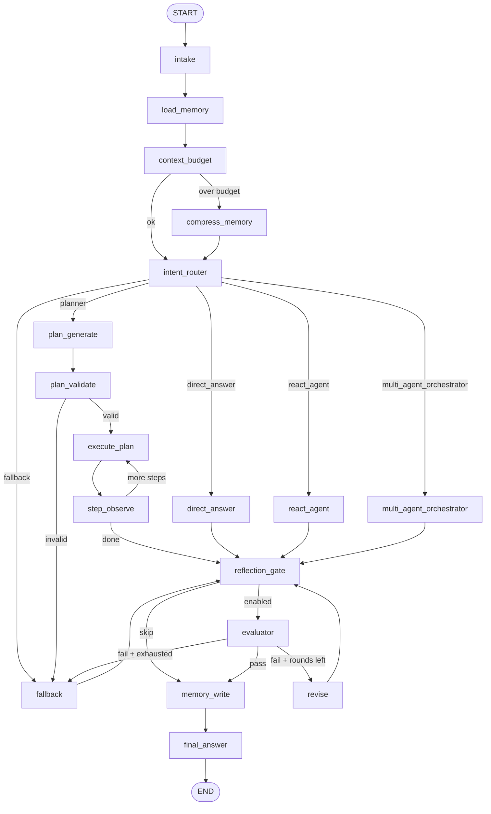

# Runtime Graph Map

Compiled graph entry: `langgraph.json` → `./src/agent/graph.py:graph` (`build_graph()`).

Control plane nodes run on every request. Execution paths branch after `intent_router`. All successful paths converge on `reflection_gate` → (`evaluator` optional) → `memory_write` → `final_answer`.

## Topology

## Route paths (`IntentDecision.path`)

| Path | Entry nodes | Notes |
|------|-------------|-------|
| `direct_answer` | `direct_answer` | SiliconFlow LLM, low-risk prompts |
| `react_agent` | `react_agent` | Bounded ReAct loop + MCP tools |
| `planner` | `plan_generate` → `plan_validate` → `execute_plan` ↔ `step_observe` | Deterministic plan generation; LLM/tool/agent steps |
| `multi_agent_orchestrator` | `multi_agent_orchestrator` | Parallel LLM workers (researcher/coder/reviewer/memory manager) |
| `fallback` | `fallback` | Clarification, validation failure, reflection exhaustion |

Router implementation: `src/agent/router.py` (`route_intent`). Conditional edge selectors live beside nodes in `graph.py`, `planner.py`, and `reflection.py`.

## Observability

Each major node appends to `runtime_events` and refreshes `path_metrics` via `src/agent/observability.py` (`NodeTracker`). See [state-contract.md](./state-contract.md).
