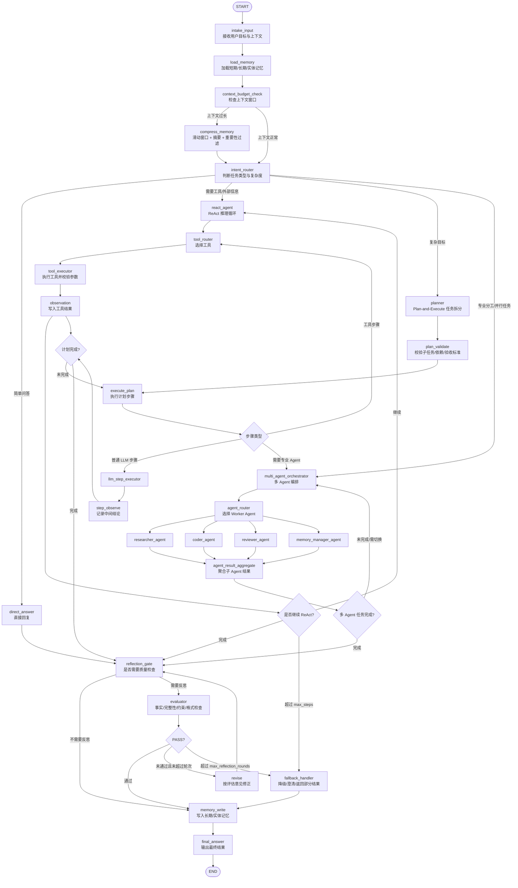

```mermaid

flowchart TD
  START([START]) --> intake["intake_input<br/>接收用户目标与上下文"]

  intake --> load_memory["load_memory<br/>加载短期/长期/实体记忆"]
  load_memory --> context_budget["context_budget_check<br/>检查上下文窗口"]

  context_budget -->|上下文过长| compress_memory["compress_memory<br/>滑动窗口 + 摘要 + 重要性过滤"]
  context_budget -->|上下文正常| intent_router["intent_router<br/>判断任务类型与复杂度"]
  compress_memory --> intent_router

  intent_router -->|简单问答| direct_answer["direct_answer<br/>直接回复"]
  intent_router -->|需要工具/外部信息| react_loop["react_agent<br/>ReAct 推理循环"]
  intent_router -->|复杂目标| planner["planner<br/>Plan-and-Execute 任务拆分"]
  intent_router -->|专业分工/并行任务| orchestrator["multi_agent_orchestrator<br/>多 Agent 编排"]

  direct_answer --> reflection_gate["reflection_gate<br/>是否需要质量检查"]

  react_loop --> tool_router["tool_router<br/>选择工具"]
  tool_router --> tool_exec["tool_executor<br/>执行工具并校验参数"]
  tool_exec --> observation["observation<br/>写入工具结果"]
  observation --> react_continue{"是否继续 ReAct?"}
  react_continue -->|继续| react_loop
  react_continue -->|完成| reflection_gate
  react_continue -->|超过 max_steps| fallback["fallback_handler<br/>降级/澄清/返回部分结果"]

  planner --> plan_validate["plan_validate<br/>校验子任务/依赖/验收标准"]
  plan_validate --> execute_plan["execute_plan<br/>执行计划步骤"]
  execute_plan --> step_router{"步骤类型"}
  step_router -->|普通 LLM 步骤| llm_step["llm_step_executor"]
  step_router -->|工具步骤| tool_router
  step_router -->|需要专业 Agent| orchestrator

  llm_step --> step_observe["step_observe<br/>记录中间结论"]
  step_observe --> plan_done{"计划完成?"}
  observation --> plan_done
  plan_done -->|未完成| execute_plan
  plan_done -->|完成| reflection_gate

  orchestrator --> agent_router["agent_router<br/>选择 Worker Agent"]
  agent_router --> researcher["researcher_agent"]
  agent_router --> coder["coder_agent"]
  agent_router --> reviewer["reviewer_agent"]
  agent_router --> memory_manager["memory_manager_agent"]

  researcher --> agent_result["agent_result_aggregate<br/>聚合子 Agent 结果"]
  coder --> agent_result
  reviewer --> agent_result
  memory_manager --> agent_result

  agent_result --> multi_done{"多 Agent 任务完成?"}
  multi_done -->|未完成/需切换| orchestrator
  multi_done -->|完成| reflection_gate

  reflection_gate -->|不需要反思| memory_write["memory_write<br/>写入长期/实体记忆"]
  reflection_gate -->|需要反思| evaluator["evaluator<br/>事实/完整性/约束/格式检查"]

  evaluator --> eval_pass{"PASS?"}
  eval_pass -->|通过| memory_write
  eval_pass -->|未通过且未超过轮次| revise["revise<br/>按评估意见修正"]
  eval_pass -->|超过 max_reflection_rounds| fallback

  revise --> reflection_gate

  fallback --> memory_write
  memory_write --> final_answer["final_answer<br/>输出最终结果"]
  final_answer --> END([END])

```